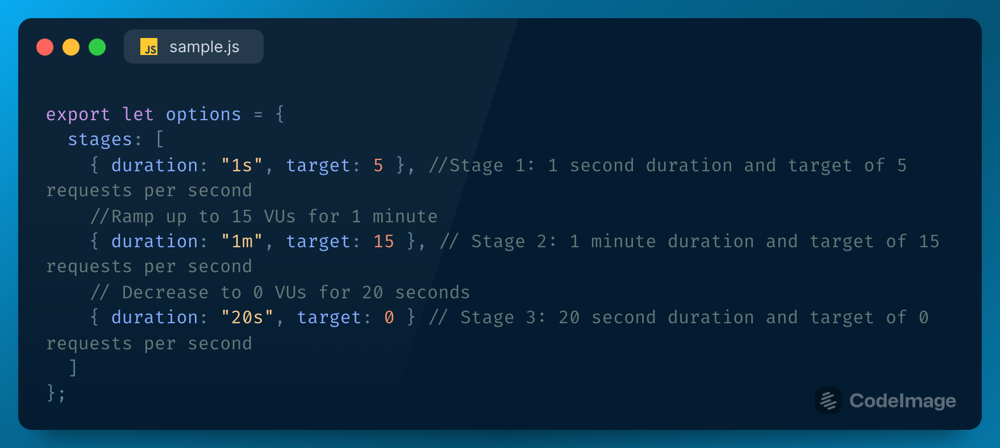

[](https://github.com/grafana/k6)

# k6 Performance Testing Framework

This is a generic [k6](https://k6.io/) performance testing framework that can be used to test the performance of different APIs. The framework uses the k6 library to send HTTP requests and check the responses for various conditions.

## Getting Started

To use this framework, you need to have Node.js and k6 installed on your machine.

- Clone the Repository

```bash
> git clone https://github.com/farhanlabib/k6-performance-testing-framework.git
> cd k6-performance-testing-framework
> npm install
```

- Install k6

```bash
https://k6.io/docs/get-started/installation/
```
## Folder Structure

Code is structured as shown below:

```
k6-Performance-Testing-Framework/
 ├── specs                                  # The k6 test file is located in the spec folder.
 │    ├──sample.js                          # k6 test script
 |
 ├── test.csv                               # Console Log File
```
## Configuring the Test

The performance tests are configured using the options variable in the test script. The options variable defines the stages of the load test, including the duration and target number of requests per second for each stage.



The current configuration is set up as follows:

- Stage 1: 1 second duration and target of 5 requests per second
- Stage 2: 1 minute duration and target of 15 requests per second
- Stage 3: 20 second duration and target of 0 requests per second

## Writing the Test


The test file is a JavaScript file that contains the test script. The script imports the http module and check function from the k6 library. It defines the stages of the load test using the options variable. The test script makes a POST request to the API endpoint with the payload and headers. It checks the response for various conditions and logs the error to the console if the status is not 200.

## Run the Test

```bash
npm test specs/sample.js
```
This command will execute the test file and provide a summary of the test results in the console.

```bash
npm test --  --log-format raw specs/sample.js --console-output=./test.csv
```
This command will execute the test file and provide a detailed raw log of the test results in a csv file.
## Conclusion

This is a basic example of how to use the k6 performance testing framework to test the performance of a web application or API. You can customize the test to suit your needs by changing the options and the test function.

Feel free to fork and make pull request for any additional feature.

